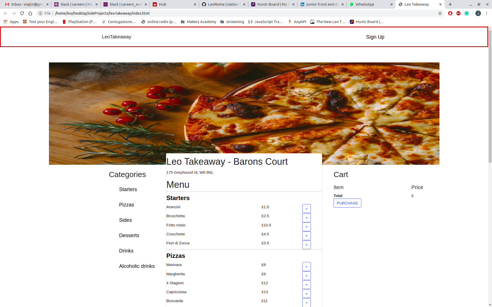
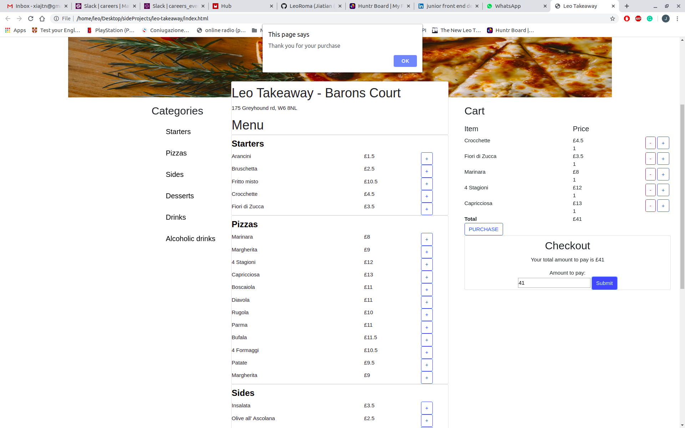

# Description

This project is a mockup of Just Eat and is a Single Page App.
- The tech-stack I used is: 
- for UI HTML, Bootstrap and CSS.
- for the DOM manipulation, Javascript, JQuery and Mustache.
- The user can add multiple items in the shopping cart, but not the same item more than one time.
- The user can remove the item from the shopping cart.
- The user can't checkout if the shopping cart is empty.
- The user can't complete the purchase if didn't insert the correct amount.

# Instruction

- Open your terminal.
- Type the follow command `git clone https://github.com/LeoRoma/leo-takeaway.git`
- Cd leo-takeaway.
- Run `npm install` to install the dependencies.
- Open the project in your text-editor.
- Copy the full path from `index.html` in your browser.

# Screenshots

================
